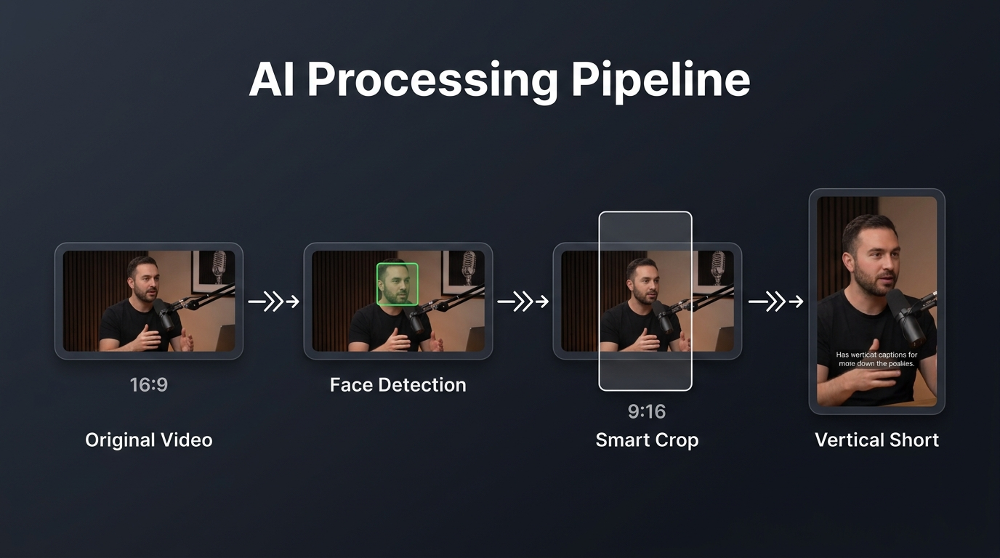
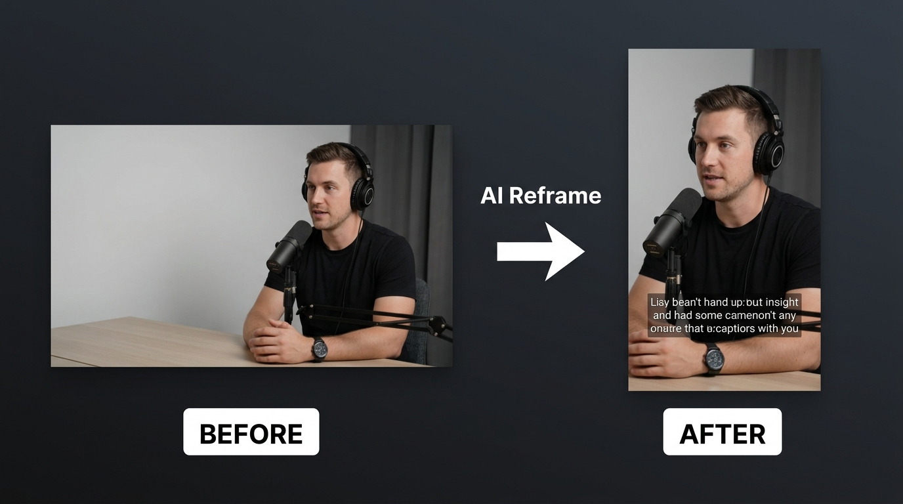
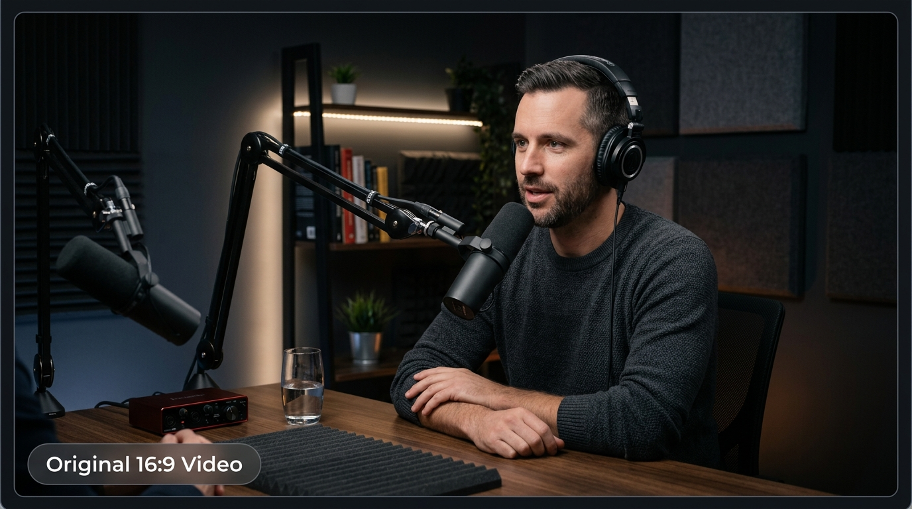
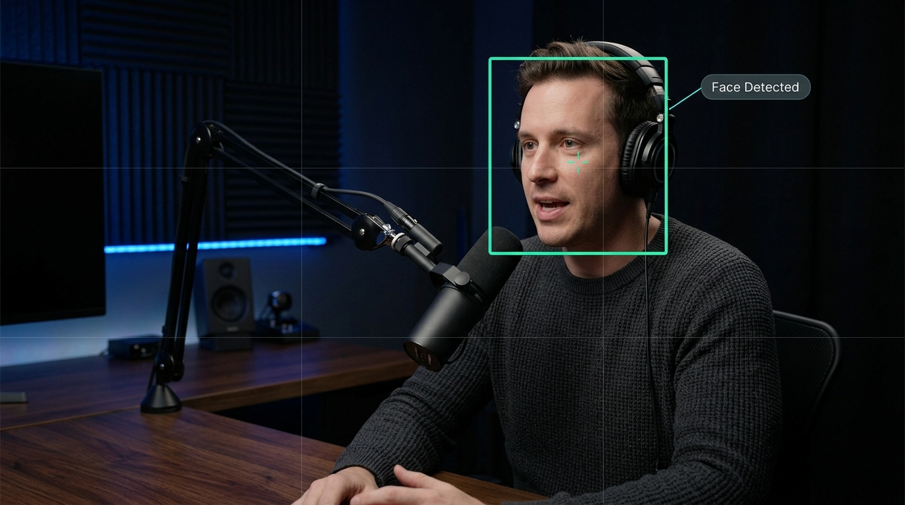
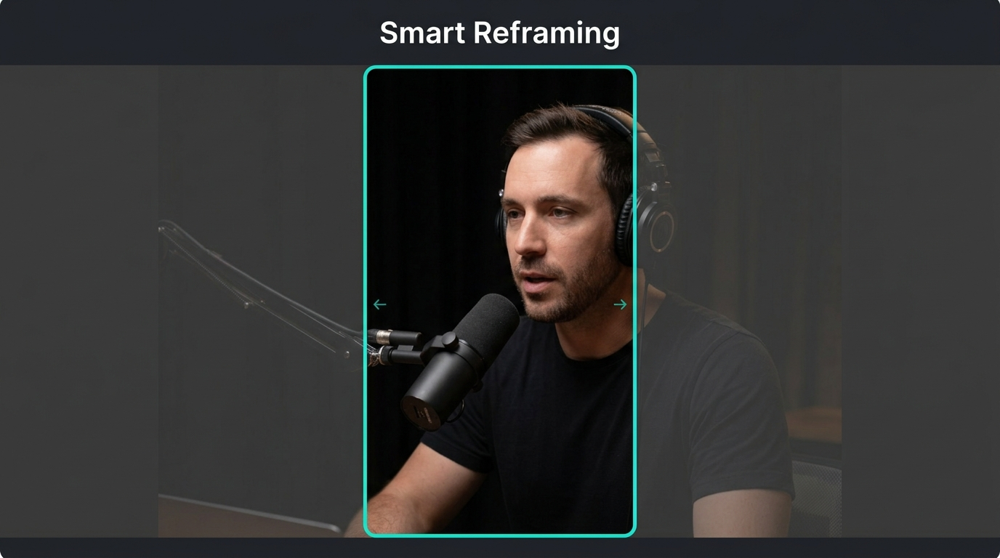
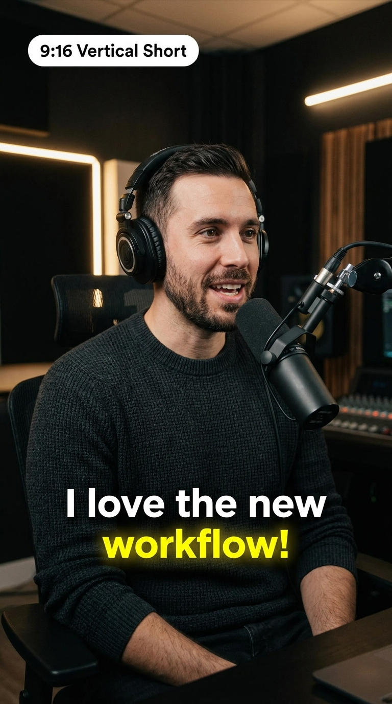

<div align="center">

# 🎬 AI Clips Studio

**Transform long-form videos into viral short-form clips — automatically.**

An offline, AI-powered desktop web app that detects highlights, tracks faces, reframes for 9:16, adds captions, and exports ready-to-publish Shorts, Reels & TikToks.



[](https://python.org)
[](https://reactjs.org)
[](https://typescriptlang.org)
[](https://ffmpeg.org)
[](LICENSE)

</div>

---

## ✨ Key Features

| Feature | Description |
|---------|-------------|
| 🧠 **AI Highlight Detection** | Automatically finds the most engaging moments in long videos |
| 👤 **Face Detection & Tracking** | YOLOv8-powered face detection with frame-by-frame tracking |
| 🎯 **Smart Reframing** | Face-aware 16:9 → 9:16 crop with smooth camera movements |
| 📝 **Auto Captions** | Whisper-based transcription with 10+ stylized caption formats |
| 🎨 **Hook Text Overlay** | Auto-generated attention-grabbing hook text on the first frame |
| 🖼️ **Thumbnail Generation** | Auto-generated cover thumbnails for every clip |
| 📷 **End Thumbnail** | Upload a custom 9:16 image appended to the clip for YouTube Shorts thumbnails |
| 🎵 **Background Music** | Optional background music from a built-in library |
| 🌐 **Translation** | Translate captions and metadata into multiple languages |
| ✂️ **Manual Editing** | Trim, re-render, edit metadata, and fine-tune every clip |
| 📡 **Real-Time Progress** | Socket.IO live progress updates for every pipeline stage |

---

## 🔄 How It Works

Upload a horizontal video → the AI pipeline does everything → download vertical shorts.



### The Processing Pipeline

The system runs a **15-stage AI pipeline** that transforms each video through detection, analysis, reframing, and rendering:

<table>
<tr>
<td width="50%">

#### Stage 1 — Input Video
A standard 16:9 horizontal video (podcast, interview, lecture, vlog, etc.) is uploaded through the web UI.



</td>
<td width="50%">

#### Stage 2 — Face Detection
YOLOv8 detects all faces in every frame. Bounding boxes and confidence scores are computed for accurate subject tracking.



</td>
</tr>
<tr>
<td width="50%">

#### Stage 3 — Smart Reframing
The system calculates the optimal 9:16 crop region that keeps the speaker centered. The crop window follows face movement with smooth, cinematic camera transitions.



</td>
<td width="50%">

#### Stage 4 — Vertical Output
The final 1080×1920 vertical clip with styled captions, hook text overlay, and auto-generated thumbnail — ready for YouTube Shorts, TikTok, or Instagram Reels.



</td>
</tr>
</table>

### Full Pipeline Stages

```
 Upload Video
     │
     ▼
 ┌─────────────────────────────────────────────────────────────┐
 │  Stage 01 │ Audio Extraction          (FFmpeg)              │
 │  Stage 02 │ Voice Activity Detection  (Silero VAD)          │
 │  Stage 03 │ Speech Transcription      (Faster-Whisper)      │
 │  Stage 03 │ Speaker Diarization       (Pyannote)            │
 │  Stage 04 │ Highlight Detection       (Ollama LLM)          │
 │  Stage 05 │ Scene Detection           (PySceneDetect)       │
 │  Stage 06 │ Face Detection            (YOLOv8)              │
 │  Stage 07 │ Face Tracking & Identity  (OpenCV + Clustering)  │
 │  Stage 08 │ Camera Planning & Crop    (Custom Engine)       │
 │  Stage 09 │ Cut & Crop Rendering      (FFmpeg)              │
 │  Stage 10 │ Caption Overlay           (FFmpeg + PIL)        │
 │  Stage 11 │ Metadata Generation       (Ollama LLM)          │
 │  Stage 12 │ Export & Packaging        (FFmpeg)              │
 │  Stage 13 │ Thumbnail Generation      (FFmpeg)              │
 │  Stage 14 │ Background Music          (FFmpeg)              │
 │  Stage 15 │ Translation               (Ollama LLM)          │
 └─────────────────────────────────────────────────────────────┘
     │
     ▼
 Results Page → Preview, Edit, Export, Download
```

---

## 🛠️ Tech Stack

### Frontend
| Technology | Purpose |
|------------|---------|
| **React 18** | Component-based UI |
| **TypeScript** | Type safety |
| **Vite** | Fast dev server & build |
| **Tailwind CSS** | Utility-first styling |
| **Zustand** | Lightweight state management |
| **Socket.IO Client** | Real-time progress updates |
| **React Player** | Video preview playback |

### Backend
| Technology | Purpose |
|------------|---------|
| **Express.js** | REST API server |
| **TypeScript** | Type safety |
| **Socket.IO** | Real-time event streaming |
| **Multer** | File upload handling |
| **Archiver** | ZIP export packaging |
| **Winston** | Structured logging |

### AI Pipeline
| Technology | Purpose |
|------------|---------|
| **Python 3.10+** | Pipeline orchestration |
| **FFmpeg** | Video/audio processing |
| **Faster-Whisper** | Speech-to-text transcription |
| **Silero VAD** | Voice activity detection |
| **YOLOv8 (Ultralytics)** | Face detection |
| **OpenCV** | Face tracking & image processing |
| **PySceneDetect** | Scene change detection |
| **Pyannote.audio** | Speaker diarization |
| **Ollama** | Local LLM for highlights, metadata & translation |
| **Stable-TS** | Timestamp-aligned transcription |
| **PIL / Pillow** | Caption & hook text rendering |

---

## 🚀 Installation

### Prerequisites

- **Node.js** 18+ and **npm**
- **Python** 3.10+
- **FFmpeg** installed and available in PATH
- **Ollama** running locally (for LLM-powered stages)
- **GPU recommended** (CUDA-compatible for faster Whisper & YOLO inference)

### 1. Clone the Repository

```bash
git clone https://github.com/your-username/ai-clips-studio.git
cd ai-clips-studio
```

### 2. Install Frontend Dependencies

```bash
cd frontend
npm install
```

### 3. Install Backend Dependencies

```bash
cd backend
npm install
```

### 4. Install Python Dependencies

```bash
pip install -r ai/requirements.txt
```

### 5. Download AI Models

```bash
python download_models.py
```

### 6. Start Ollama

```bash
ollama serve
```

> Pull a model if you haven't already: `ollama pull llama3`

### Quick Start (Windows)

```bash
setup.bat
```

### Quick Start (Linux / macOS)

```bash
chmod +x setup.sh
./setup.sh
```

---

## ▶️ Usage

### Start the Backend

```bash
cd backend
npm run dev
```

The API server starts at `http://localhost:3001`.

### Start the Frontend

```bash
cd frontend
npm run dev
```

The web UI opens at `http://localhost:5173`.

### Workflow

1. **Upload** — Drag or select a long-form video (MP4, MOV, AVI, MKV, WEBM)
2. **Configure** — Choose clip count, duration range, caption style, and layout
3. **Process** — Click Generate and watch real-time progress for all 15 stages
4. **Review** — Browse generated clips with thumbnails, metadata, and previews
5. **Edit** — Trim clips, edit titles/descriptions/hashtags, adjust metadata
6. **Export** — Download individual clips or a ZIP bundle

---

## 📁 Project Structure

```
ai-clips-studio/
│
├── frontend/                    # React + TypeScript + Vite
│   └── src/
│       ├── components/
│       │   ├── Results/         # Results page & clip cards
│       │   └── Editor/          # Clip editor with trim & re-render
│       ├── stores/              # Zustand state management
│       ├── hooks/               # Custom React hooks
│       ├── types/               # TypeScript type definitions
│       └── App.tsx              # Main app with routing
│
├── backend/                     # Express + TypeScript
│   └── src/
│       ├── routes/              # REST API endpoints
│       ├── services/            # Business logic (results, clips)
│       └── server.ts            # Entry point + Socket.IO
│
├── ai/                          # Python AI Pipeline
│   ├── pipeline/
│   │   ├── pipeline.py          # Main pipeline orchestrator
│   │   ├── retrim.py            # Re-render engine
│   │   ├── render_engine.py     # FFmpeg render helpers
│   │   ├── metadata_engine.py   # LLM metadata generation
│   │   ├── hook_renderer.py     # Hook text image renderer
│   │   ├── music_library.py     # Background music manager
│   │   ├── highlights/          # Highlight detection & scoring
│   │   ├── translation/         # Multi-language support
│   │   └── stages/              # 15 pipeline stages
│   │       ├── stage_01_audio.py
│   │       ├── stage_02_vad.py
│   │       ├── stage_03_transcription.py
│   │       ├── stage_03_speaker_diarization.py
│   │       ├── stage_04_highlights.py
│   │       ├── stage_05_scene_detection.py
│   │       ├── stage_06_face_detection.py
│   │       ├── stage_07_face_tracking.py
│   │       ├── stage_08_smooth_crop.py
│   │       ├── stage_08a_camera_planning.py
│   │       ├── stage_08b_anchor_stream.py
│   │       ├── stage_08c_camera_operator.py
│   │       ├── stage_08d_transition_planner.py
│   │       ├── stage_09_cut_crop.py
│   │       ├── stage_10_captions.py
│   │       ├── stage_11_metadata.py
│   │       ├── stage_12_export.py
│   │       ├── stage_13_thumbnails.py
│   │       ├── stage_14_music.py
│   │       └── stage_15_translation.py
│   └── requirements.txt
│
├── config/                      # App configuration
├── models/                      # Downloaded AI model weights
├── storage/                     # Uploads, outputs, temp files
│   ├── uploads/                 # Uploaded source videos
│   └── outputs/                 # Generated clips, thumbnails, metadata
├── docs/
│   └── images/                  # README visuals
├── setup.bat                    # Windows setup script
├── setup.sh                     # Linux/macOS setup script
├── download_models.py           # Model downloader utility
└── README.md
```

---

## 🎥 Caption Styles

Choose from **10+ caption formats** during generation:

| Style | Description |
|-------|-------------|
| Classic White | Clean white subtitles |
| Green / Yellow / Blue / Red Highlight | Color-accented active word |
| Boxed | Text in rounded background boxes |
| Outline | Stroke-outlined text |
| Bold Pop | Large bold animated captions |
| Karaoke | Word-by-word highlight animation |
| Minimal | Small, unobtrusive subtitles |
| Creator Style | Popular creator-inspired layout |
| Viral Style | Trending social media caption look |

---

## 🔮 Future Improvements

- [ ] Multi-speaker layout (split-screen for interviews)
- [ ] GPU-accelerated FFmpeg rendering pipeline
- [ ] Cloud deployment with job queue
- [ ] Batch processing for multiple videos
- [ ] Custom brand templates and watermarks
- [ ] Direct publishing to YouTube, TikTok, Instagram
- [ ] A/B test thumbnail generator
- [ ] Voice cloning for translated audio dubbing

---

## 📄 License

This project is licensed under the [MIT License](LICENSE).

---

<div align="center">

**Built with ❤️ using React, Express, Python, FFmpeg, and local AI models.**

</div>
