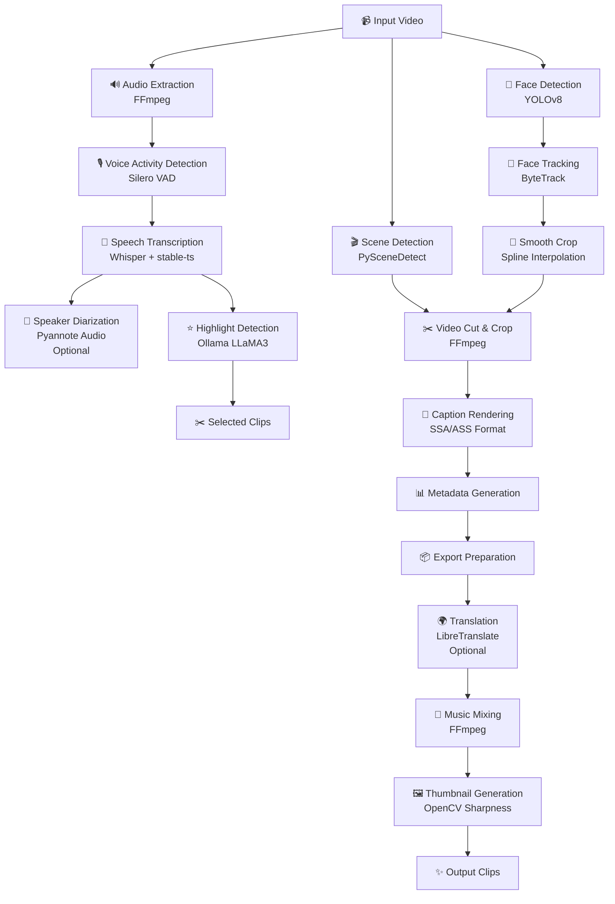
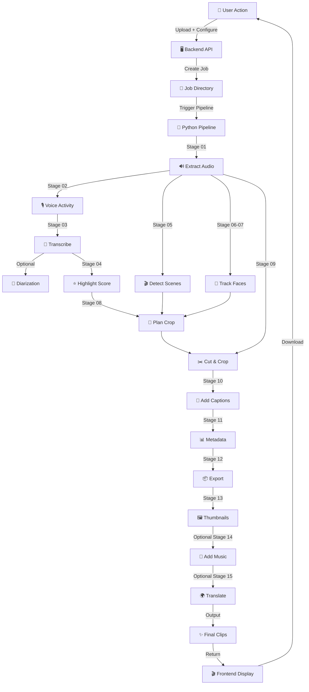

# AI Models & Pipeline Documentation

**AI Shorts Generator** — Offline desktop web application for automatically converting long-form videos into YouTube Shorts and social media clips using machine learning.

---

## Overview

The AI Shorts Generator pipeline processes video through a multi-stage AI-driven system to automatically identify highlights, extract engaging segments, generate captions, and export polished short clips.

**Processing Flow:**

```
Input Video
    ↓
[Stage 01] Audio Extraction
    ↓
[Stage 02] Voice Activity Detection (VAD)
    ↓
[Stage 03] Speech Transcription
    ↓
[Stage 03b] Speaker Diarization (optional)
    ↓
[Stage 04] Highlight Detection + Scoring
    ↓
[Stage 05] Scene Detection
    ↓
[Stage 06] Face Detection (sampling)
    ↓
[Stage 07] Face Tracking + ByteTrack
    ↓
[Stage 08] Smooth Crop Planning
    ↓
[Stage 09] Video Cut & Crop
    ↓
[Stage 10] Caption Generation & Rendering
    ↓
[Stage 11] Metadata Generation
    ↓
[Stage 12] Export Preparation
    ↓
[Stage 15] Translation (optional)
    ↓
[Stage 14] Background Music Mixing
    ↓
[Stage 13] Thumbnail Generation
    ↓
Output Clips + Metadata
```

---

## AI Pipeline Architecture



---

## AI Models Table

| Model | Purpose | Framework | Type | Input | Output | Stage | Device | Notes |
|-------|---------|-----------|------|-------|--------|-------|--------|-------|
| **Whisper (OpenAI)** | Speech-to-text transcription | PyTorch + faster-whisper | ASR | Audio WAV (16kHz mono) | Segments + words + timestamps | 03 | Auto (CPU/GPU) | Supports tiny/medium/large-v3; word-level timestamps via stable-ts |
| **Silero VAD** | Voice activity detection | ONNX | Voice Detection | Audio WAV (16kHz) | Speech/silence timestamps | 02 | CPU | Lightweight; detects speech segments; fallback to ONNX or JIT model |
| **Pyannote Audio 3.1** | Speaker diarization | PyTorch HuggingFace | Audio Classification | Audio WAV + authentication | Speaker turns + IDs | 03b | Auto (CPU/GPU) | Requires HuggingFace token; disabled by default; per-word speaker labels |
| **YOLOv8 Nano** | Person detection & tracking | Ultralytics PyTorch | Object Detection | Video frames (640×640) | Bounding boxes + class IDs | 06-07 | Auto (CPU/GPU) | Detects persons (class 0); confidence filter 0.40; tracks with ByteTrack |
| **ByteTrack** | Multi-object tracking | Ultralytics YAML | Tracking | Detections over time | Track IDs + trajectories | 07 | CPU | Built into YOLOv8; assigns persistent track IDs to faces |
| **PySceneDetect** | Scene/cut detection | OpenCV | Video Analysis | Video stream | Scene boundaries + timestamps | 05 | CPU | ContentDetector algorithm; configurable threshold (default 27.0) |
| **LLaMA3 8B** | Highlight generation + reasoning | Ollama + LLaMA3 | LLM | Transcript JSON | Scored highlights with hooks/reasons | 04 | GPU (Ollama) | Local inference only; requires Ollama running; int8 quantized for speed |
| **LibreTranslate** | Multilingual translation | Translation API | NMT | Caption text + language | Translated text | 15 | External API | Optional provider; requires local LibreTranslate server running |
| **stable-ts (Stable Whisper)** | Precise word timestamps | PyTorch | ASR Enhancement | Whisper output | Word-level alignments | 03 | Auto | Fallback to faster-whisper if stable-ts unavailable |
| **FFmpeg** | Video/audio manipulation | C library + ffmpeg-python | Codec | Video/audio files | Processed frames/audio | 01, 09, 15, 14 | CPU | Audio extraction; video encoding (libx264); effects (blur, overlay) |
| **OpenCV** | Image processing utilities | C++ library + cv2 | Vision | Video frames | Processed images | 08, 13 | CPU | Thumbnail sharpness detection; crop interpolation; video capture |

---

## Detailed Model Documentation

### Whisper (OpenAI)

**Purpose:**
- Transcribe audio to text with word-level timestamp precision
- Provides language detection and automatic speech recognition
- Foundation for all downstream NLP tasks (highlights, captions, translation)

**Why Selected:**
- Industry-standard open-source ASR model
- Multi-language support out-of-box
- Word-level timestamps enable precise caption synchronization
- Stable-ts integration improves alignment accuracy

**Location:**
- Execution: [ai/pipeline/stages/stage_03_transcription.py](../ai/pipeline/stages/stage_03_transcription.py)
- Models downloaded to: `models/whisper-{tiny|medium|large-v3}/`
- Download script: [download_models.py](../download_models.py#L41)

**Pipeline Stage:**
Stage 03 — Transcription (after VAD, before highlights)

**Input:**
- Audio WAV file (16 kHz, mono, PCM s16le)
- From: `storage/temp/{job_id}/audio.wav`

**Output:**
- JSON with segments, word-level timestamps, language, duration
- Saved to: `storage/temp/{job_id}/transcript.json`
- Schema: `{ text, language, segments[], words[], duration, model, timingEngine }`

**Configuration:**
```json
{
  "whisper": {
    "defaultModel": "medium",      // tiny, medium, large-v3
    "computeType": "int8",         // int8, int16, float16, float32
    "beamSize": 5,                 // beam search width
    "language": null               // auto-detect if null
  }
}
```

**Model Sizes:**
| Model | Parameters | File Size | RAM | Speed (GPU) | Speed (CPU) | Quality |
|-------|-----------|-----------|-----|------------|------------|---------|
| tiny | 39M | ~140 MB | ~1 GB | ~5-10s/min | ~30-60s/min | Good |
| medium | 769M | ~1.5 GB | ~4 GB | ~2-3s/min | ~15-30s/min | Very Good |
| large-v3 | 1.5B | ~2.9 GB | ~8 GB | ~1-2s/min | ~5-10s/min | Excellent |

**Device Support:**
- GPU: NVIDIA CUDA (auto-detected); uses INT8 quantization for memory efficiency
- CPU: Fallback mode; slower but functional
- Apple Metal: Not explicitly supported; CPU fallback

**Language Support:**
- 99+ languages automatically detected
- English optimized; other languages have slight accuracy reduction
- User can force specific language in settings

**Performance Notes:**
- Faster-whisper backend: ~2-3x faster than standard Whisper
- Stable-ts alignment adds ~10-15% overhead but improves word precision ±50ms
- Beam search width of 5 balances accuracy vs. speed
- INT8 quantization reduces memory footprint by ~4x with negligible quality loss

**Limitations:**
- Cannot distinguish between multiple speakers (use pyannote for diarization)
- Hallucination risk on long silences (mitigated by VAD pre-filtering)
- Time zone abbreviations and proper nouns sometimes misrecognized
- Non-English accents have higher error rates

**Future Improvements:**
- Whisper V3 for better cross-lingual support
- Local fine-tuning on domain-specific vocabulary
- Real-time streaming mode for live processing
- Multi-speaker speaker separation integration

---

### Silero VAD (Voice Activity Detection)

**Purpose:**
- Detect speech vs. silence segments before transcription
- Reduce processing time by skipping non-speech regions
- Improve transcription quality by filtering background noise

**Why Selected:**
- Extremely lightweight ONNX model
- CPU-only inference (no GPU needed)
- High accuracy for speech detection
- No internet dependency

**Location:**
- Execution: [ai/pipeline/stages/stage_02_vad.py](../ai/pipeline/stages/stage_02_vad.py)
- Model file: `models/silero_vad.onnx` (or `.jit`)
- Download script: [download_models.py](../download_models.py#L29)

**Pipeline Stage:**
Stage 02 — Voice Activity Detection (after audio extraction, before transcription)

**Input:**
- Audio WAV file (16 kHz, mono)
- Duration metadata

**Output:**
- JSON with speech segments and silence intervals
- Saved to: `storage/temp/{job_id}/speech_timestamps.json`
- Schema: `{ duration, method, silences[], segments[] }`

**Configuration:**
- No user configuration; uses defaults
- Threshold optimization done internally by model

**Model Size:**
- File: ~2 MB (ONNX format)
- RAM: <50 MB
- Speed: Real-time on CPU (1 minute audio ~200ms)

**Device Support:**
- CPU only; ONNX Runtime
- PyTorch JIT fallback if ONNX unavailable
- Single-threaded execution for consistency

**Performance Notes:**
- Processes entire audio in ~0.2-0.3x real-time
- Minimum detectable speech duration: ~100ms
- Works well for podcast, interview, and educational content
- May miss very quiet speech or background music

**Limitations:**
- Cannot distinguish speakers
- Music/singing sometimes falsely detected as speech
- Very loud background noise can cause miss-detections
- No adaptive threshold per audio characteristic

**Future Improvements:**
- Silero VAD V5 with improved music discrimination
- Adaptive thresholding based on audio analysis
- Multi-speaker VAD for overlapping speech

---

### Pyannote Audio 3.1 (Speaker Diarization)

**Purpose:**
- Identify different speakers in audio
- Assign speaker labels (Speaker 1, Speaker 2, etc.) to transcript words
- Enable "who said what" analysis for multi-speaker content

**Why Selected:**
- State-of-the-art speaker diarization on HuggingFace
- Pre-trained on diverse audio conditions
- Outputs speaker embeddings for robust tracking

**Location:**
- Execution: [ai/pipeline/stages/stage_03_speaker_diarization.py](../ai/pipeline/stages/stage_03_speaker_diarization.py)
- Model: `pyannote/speaker-diarization-3.1` (remote HuggingFace)
- Requires: HuggingFace authentication token

**Pipeline Stage:**
Stage 03b — Speaker Diarization (optional; runs after transcription)

**Input:**
- Audio WAV file (16 kHz)
- HuggingFace token (from settings or env var `HUGGINGFACE_TOKEN`)

**Output:**
- Speaker turns + IDs; annotates transcript with speaker labels
- Saved to: `storage/temp/{job_id}/speaker_diarization.json`
- Schema: `{ enabled, skipped, reason, turns[] }`

**Configuration:**
```json
{
  "speakerDiarization": true,              // enable/disable
  "huggingFaceToken": "hf_..."             // auth token
}
```

**Model Size:**
- Downloaded on-demand from HuggingFace
- RAM: ~2-4 GB during inference
- Speed: ~0.5-1x real-time on GPU

**Device Support:**
- GPU (CUDA/Metal) strongly recommended; CPU fallback very slow
- Requires pyannote.audio library with PyTorch backend

**Performance Notes:**
- Typically identifies 2-4 speakers per video accurately
- Becomes unreliable with >6 speakers or heavy overlap
- Requires ~30 seconds minimum audio for accurate clustering
- Diarization errors propagate to transcript speaker labels

**Limitations:**
- Cannot work offline (HuggingFace model download required)
- Requires authentication token (terms of service)
- Audio quality impacts accuracy significantly
- Cannot separate very similar voices

**When Disabled:**
- Skipped by default due to API requirements
- Graceful fallback: all words marked as "Unknown Speaker"
- Pipeline continues without speaker information

**Future Improvements:**
- Local model caching to reduce repeated downloads
- Real-time speaker change detection
- Integration with face detection for speaker-video mapping

---

### YOLOv8 Nano (Person Detection & Tracking)

**Purpose:**
- Detect persons (bounding boxes) in video frames
- Enable smooth cropping around detected subjects
- Track face/person position across frames via ByteTrack

**Why Selected:**
- Fast inference on CPU/GPU
- Lightweight model (nano variant ~3.2 MB)
- COCO pre-trained with 80 object classes
- Built-in multi-object tracking support

**Location:**
- Execution:
  - Detection: [ai/pipeline/stages/stage_06_face_detection.py](../ai/pipeline/stages/stage_06_face_detection.py)
  - Tracking: [ai/pipeline/stages/stage_07_face_tracking.py](../ai/pipeline/stages/stage_07_face_tracking.py)
- Model file: `models/yolov8n.pt`
- Download script: [download_models.py](../download_models.py#L36)

**Pipeline Stages:**
- Stage 06 — Face Detection (sampling every Nth frame)
- Stage 07 — Face Tracking (ByteTrack across entire video)

**Input:**
- Video stream (any resolution; internally resized to 640×640)
- Frame sampling: Every Nth frame (where N = fps / 2)

**Output (Stage 06):**
- Detection JSON: bounding boxes + confidence per sampled frame
- Saved to: `storage/temp/{job_id}/face_detections.json`

**Output (Stage 07):**
- Track JSON: persistent track IDs + detection sequences
- Saved to: `storage/temp/{job_id}/face_tracks.json`
- Schema: `{ trackId, start, end, frames[], detections[], detectionCount, averageConfidence }`

**Configuration:**
```json
{
  "yoloModel": "yolov8n.pt"  // nano (default), small, medium, large
}
```

**Model Variants:**
| Variant | Size | Speed (GPU) | Accuracy | Best For |
|---------|------|-----------|----------|----------|
| nano (n) | 3.2 MB | ~40 FPS | Good | Real-time on CPU |
| small (s) | 27 MB | ~20 FPS | Very Good | Balanced |
| medium (m) | 49 MB | ~10 FPS | Excellent | Accuracy priority |
| large (l) | 94 MB | ~5 FPS | Best | Maximum accuracy |

**Device Support:**
- GPU (CUDA/Metal): ~40-100 FPS depending on variant
- CPU: ~5-15 FPS (usable for batch processing)
- Auto-detection; falls back to CPU if no GPU

**Person Detection Quality:**
- Confidence threshold: 0.40 (filters low-confidence boxes)
- Minimum size filter: 6% frame width, 10% frame height (removes noise)
- Area + center-proximity scoring balances large subjects + off-center framing
- Top-1 person per frame selected for tracking

**ByteTrack Tracking:**
- Algorithm: ByteTrack (multi-object tracking via association)
- Persistence: Maintains track ID across frames even if detection drops
- Speed: Real-time on GPU; ~0.1-0.5x real-time on CPU

**Performance Notes:**
- Stage 06 samples frames at 0.5x FPS (e.g., 15 FPS for 30fps video)
- Stage 07 processes all frames but subsamples for inference
- Entire 10-minute video: ~30-60 seconds on GPU, ~5-10 minutes on CPU

**Limitations:**
- Only detects COCO class 0 (person); no face-specific detection
- Partial occlusions can break tracking
- Identical twins or very similar people may confuse tracking
- Side profiles and extreme angles have lower accuracy

**Future Improvements:**
- YOLOv8 Face variant for face-specific detection
- GroundingDINO for text-based person targeting
- 3D pose estimation for better cropping
- Face recognition integration for speaker-video binding

---

### ByteTrack (Multi-Object Tracking)

**Purpose:**
- Maintain consistent object IDs across video frames
- Track person centroids smoothly for cropping
- Handle temporary occlusions and brief detection gaps

**Why Selected:**
- Built-in to YOLOv8; no separate installation
- Superior re-identification accuracy vs. other trackers
- Handles frame skips and detection misses gracefully

**Location:**
- Embedded in: [ai/pipeline/stages/stage_07_face_tracking.py](../ai/pipeline/stages/stage_07_face_tracking.py)
- Configured via: `tracker="bytetrack.yaml"` in YOLOv8 track() call

**Pipeline Stage:**
Stage 07 — Face Tracking (post-detection)

**Input:**
- YOLO detections per frame (bounding boxes + confidence)

**Output:**
- Persistent track IDs; detection sequences per track
- Sorted by detection count (most-tracked persons first)

**Configuration:**
- Uses ultralytics default bytetrack.yaml
- No user tuning available

**Performance Notes:**
- Adds ~5-10% overhead to detection inference
- Successfully handles occlusions up to 30 frames
- Smooth re-identification within 2-3 frames of reappearance

**Limitations:**
- Cannot distinguish visually identical objects (e.g., twins)
- Very fast camera pans may cause ID switches
- Stationary persons sometimes lose track if undetected briefly

---

### PySceneDetect (Scene Detection)

**Purpose:**
- Identify shot boundaries (scene cuts) in video
- Enable layout switching only at natural scene transitions
- Prevent jarring crop/zoom changes mid-scene

**Why Selected:**
- Lightweight; CPU-only; no ML overhead
- ContentDetector algorithm proven for cut detection
- Customizable threshold for different editing styles

**Location:**
- Execution: [ai/pipeline/stages/stage_05_scene_detection.py](../ai/pipeline/stages/stage_05_scene_detection.py)

**Pipeline Stage:**
Stage 05 — Scene Detection (before face tracking)

**Input:**
- Video file (any format supported by OpenCV)
- Threshold setting (default: 27.0)

**Output:**
- Scene boundaries (frame indices + timestamps)
- Saved to: `storage/temp/{job_id}/scene_cuts.json`
- Schema: `{ method, threshold, scenes[] }`

**Configuration:**
```json
{
  "sceneThreshold": 27.0  // 0-100; higher = fewer cuts detected
}
```

**Algorithm:**
- ContentDetector: Frame-to-frame pixel difference histogram
- Threshold: Triggers on large histogram distance between consecutive frames
- Minimum scene duration: Not enforced (captures very fast cuts)

**Threshold Calibration:**
| Threshold | Detection Style | Best For |
|-----------|-----------------|----------|
| 15-20 | Very sensitive | Detecting all cuts, even subtle fades |
| 25-30 | Balanced (default) | Most professional content |
| 40-50 | Insensitive | Fades/dissolves only |
| 70+ | Very conservative | Stable-shot detection |

**Performance Notes:**
- Processes entire video in ~0.1-0.2x real-time
- Minimal CPU usage; no GPU required
- No ML model loading overhead

**Limitations:**
- Cannot distinguish between cuts and fast pans
- Fade/dissolve transitions are scene cuts (may not be desired)
- Cannot detect conceptual scene boundaries (e.g., speaker change without visual change)
- Depends on video quality (compressed video may miss subtle cuts)

**Future Improvements:**
- ML-based boundary detection using optical flow
- Audio-visual scene boundary detection
- Adaptive threshold based on content type

---

### LLaMA3 8B (Highlight Generation)

**Purpose:**
- Analyze transcript to identify most engaging moments
- Score highlights by engagement potential
- Provide AI-generated "hooks" and reasons for highlights

**Why Selected:**
- State-of-the-art local LLM for reasoning
- 8B parameter model balances quality vs. speed
- Runs locally via Ollama; no cloud API calls
- Supports structured JSON output for programmatic parsing

**Location:**
- Execution: [ai/pipeline/stages/stage_04_highlights.py](../ai/pipeline/stages/stage_04_highlights.py)
- LLM inference: [ai/pipeline/highlights/ollama_highlights.py](../ai/pipeline/highlights/ollama_highlights.py)
- Download/setup: [download_models.py](../download_models.py#L56)

**Pipeline Stage:**
Stage 04 — Highlight Detection (after transcription)

**Input:**
- Transcript with segments + timestamps
- User settings: clip count, duration limits, coverage target
- Optional: speaker diarization data for speaker-specific highlights

**Output:**
- Highlights JSON with scores, hooks, reasons, timestamps
- Saved to: `storage/output/{job_id}/highlights.json`
- Schema: `{ score (1-100), start, end, duration, text, hook, reason, type }`

**Configuration:**
```json
{
  "ollama": {
    "model": "llama3:8b",        // local LLM model
    "temperature": 0.3,          // creativity (0=deterministic, 1=creative)
    "maxRetries": 3              // API retry attempts
  }
}
```

**Highlight Scoring:**
Algorithm combines multiple signals:
1. **Hook word density**: Presence of engagement keywords (e.g., "shocking", "why", "reveal")
2. **Speech density**: Words per second (more speaking = higher engagement)
3. **Duration score**: Optimal ~30 seconds (penalty for too short/long)
4. **Early bonus**: Moments near video start get slight boost
5. **Punctuation bonus**: Questions and exclamations are high-engagement signals

Raw score formula:
```
score = (hook_hits × 8) + (speech_density × 12) + (duration_score × 25) 
        + (early_bonus × 10) + (punctuation_bonus × 100)
clamped to [1, 100]
```

**LLM Prompt Engineering:**
- Temperature 0.3: Low creativity; deterministic reasoning
- JSON structure validation: Clamps all fields; handles malformed responses
- Retry logic: Re-invokes on JSON parse failures (up to 3 attempts)

**Dependencies:**
- Ollama: Local LLM inference server (must be running)
- LLaMA3: Downloaded via `ollama pull llama3:8b` (~4.7 GB)

**Performance Notes:**
- First highlight generation: ~10-30 seconds (LLM inference)
- Subsequent calls: ~5-10 seconds (LLM caching)
- Requires GPU for fast inference; CPU mode very slow
- Parallelization: One highlight call per transcript

**Limitations:**
- Requires Ollama running locally (external dependency)
- Cannot access original video (text-only analysis)
- Hook word list is static; may miss domain-specific engagement
- LLM reasoning can be inconsistent across runs (even at low temperature)

**Fallback Behavior:**
- If Ollama unavailable: Uses heuristic scoring (hook words + speech density only)
- No error propagation; pipeline continues with degraded highlights
- Warning logged if Ollama check fails

**Future Improvements:**
- Fine-tuned LLaMA on highlight examples
- Multi-modal highlighting (text + visual saliency)
- Speaker-specific highlight boosting
- Real-time highlight suggestions during playback

---

### LibreTranslate (Optional Translation Provider)

**Purpose:**
- Translate captions to multiple target languages
- Enable clips for non-English-speaking audiences
- Locally-hosted translation service

**Why Selected:**
- Open-source; no cloud API dependency
- Supports 30+ language pairs
- Can run on local machine or server

**Location:**
- Execution: [ai/pipeline/stages/stage_15_translation.py](../ai/pipeline/stages/stage_15_translation.py)
- Provider configuration: [ai/pipeline/translation/providers.py](../ai/pipeline/translation/providers.py)
- Implementation: [ai/pipeline/translation/libretranslate.py](../ai/pipeline/translation/libretranslate.py)

**Pipeline Stage:**
Stage 15 — Translation (optional; runs after export preparation)

**Input:**
- Raw clips from stage 09
- Target languages list
- Caption style from settings

**Output:**
- Translated clips per language
- Saved to: `storage/output/{job_id}/translations/{language}/`
- Schema: `{ enabled, skipped, reason, provider, languages[], clips[] }`

**Configuration:**
```json
{
  "translationLanguages": ["hi", "es", "fr"],  // ISO 639-1 codes
  "translationProvider": "libretranslate",     // only option currently
  "libreTranslateUrl": "http://localhost:5000" // LibreTranslate API endpoint
}
```

**Supported Languages:**
| Code | Language | Quality |
|------|----------|---------|
| es | Spanish | Excellent |
| fr | French | Excellent |
| de | German | Excellent |
| hi | Hindi | Very Good |
| pt | Portuguese | Very Good |
| ja | Japanese | Good |
| ko | Korean | Good |
| zh | Chinese (Simplified) | Good |
| ar | Arabic | Good |

**Translation Process:**
1. Extract words from transcript
2. Group words into chunks (phrase level)
3. Translate chunk text via LibreTranslate API
4. Generate SSA/ASS subtitle with translated text
5. Re-encode video with FFmpeg subtitle filter

**Dependencies:**
- LibreTranslate server (separate installation required)
- Running on `http://localhost:5000` by default
- Can be overridden via `libreTranslateUrl` setting

**Performance Notes:**
- Translation call: ~500-1500ms per chunk (API latency)
- Re-encoding: ~5-15 seconds per clip (video encoding)
- Total for 10 clips in 3 languages: ~2-5 minutes

**Limitations:**
- Requires LibreTranslate server running externally
- Requires internet if not local
- No custom terminology/glossary support
- May mistranslate proper nouns, slang, or domain-specific terms

**Graceful Fallback:**
- If LibreTranslate unavailable: Skip translation with warning
- Pipeline continues without translated clips
- Original clips still exported

**Future Improvements:**
- Batch translation API for reduced latency
- Glossary/terminology injection
- Integration with more translation services (Google Translate, DeepL)
- On-device translation model (Argos Translate)

---

### FFmpeg (Video/Audio Processing)

**Purpose:**
- Extract audio from video
- Encode clips with custom filters and effects
- Mix background music
- Burn SSA/ASS subtitles

**Why Selected:**
- Industry-standard; widely compatible
- Fast; leverages hardware acceleration
- Comprehensive filter graph support

**Location:**
- Used across multiple stages:
  - [ai/pipeline/stages/stage_01_audio.py](../ai/pipeline/stages/stage_01_audio.py) — Audio extraction
  - [ai/pipeline/stages/stage_09_cut_crop.py](../ai/pipeline/stages/stage_09_cut_crop.py) — Cropping + encoding
  - [ai/pipeline/stages/stage_14_music.py](../ai/pipeline/stages/stage_14_music.py) — Music mixing
  - [ai/pipeline/stages/stage_15_translation.py](../ai/pipeline/stages/stage_15_translation.py) — Subtitle burning

**Pipeline Stages:**
- Stage 01 — Audio extraction
- Stage 09 — Video cut, crop, scale
- Stage 14 — Background music mixing
- Stage 15 — Translation subtitle rendering

**Input/Output:**
| Stage | Input | Output |
|-------|-------|--------|
| 01 | Video file (any format) | PCM WAV 16kHz mono |
| 09 | Video file + crop coords | Scaled 1080×1920 MP4 |
| 14 | Clip MP4 + audio track | Music-mixed MP4 |
| 15 | Clip MP4 + SSA subtitle | Caption-burned MP4 |

**Key Commands:**
```bash
# Stage 01: Audio extraction
ffmpeg -i input.mp4 -vn -acodec pcm_s16le -ar 16000 -ac 1 output.wav

# Stage 09: Crop & scale with transitions
ffmpeg -ss START -i video.mp4 -t DURATION \
  -vf "crop=...,scale=1080:1920,setsar=1" \
  -c:v libx264 -preset veryfast -crf 23 \
  -c:a aac -movflags +faststart output.mp4

# Stage 14: Music mixing with audio filters
ffmpeg -i clip.mp4 -stream_loop -1 -i music.mp3 \
  -filter_complex "[1:a]volume=0.2,afade=...;[0:a][music]amix=inputs=2" \
  -shortest -movflags +faststart output.mp4

# Stage 15: SSA subtitle burning
ffmpeg -i clip.mp4 -vf "ass='subtitle.ass'" -c:v libx264 output.mp4
```

**Encoding Settings:**
- Video codec: libx264 (H.264)
- Preset: veryfast (speed/quality balance)
- CRF: 23 (quality; 23=visually lossless)
- Audio codec: aac (compatibility)
- Format flag: +faststart (web-ready; moov atom at start)

**Performance Notes:**
- Encoding speed: ~0.5-1x real-time on CPU
- GPU acceleration: ~2-5x faster (requires NVIDIA/AMD capable GPU)
- Audio extraction: ~0.1x real-time (very fast)

**Limitations:**
- Some video formats may not be compatible
- Hardware acceleration support varies
- Very long videos (~60+ minutes) can exhaust disk space during temp encoding

---

### OpenCV (Image & Video Processing)

**Purpose:**
- Extract video frames for analysis
- Calculate image sharpness (for thumbnail selection)
- Smooth crop interpolation
- General computer vision utilities

**Location:**
- Used in multiple stages:
  - [ai/pipeline/stages/stage_08_smooth_crop.py](../ai/pipeline/stages/stage_08_smooth_crop.py)
  - [ai/pipeline/stages/stage_13_thumbnails.py](../ai/pipeline/stages/stage_13_thumbnails.py)

**Pipeline Stages:**
- Stage 08 — Smooth crop computation
- Stage 13 — Thumbnail generation

**Key Algorithms:**

**Thumbnail Sharpness Detection:**
```python
def _sharpness(frame):
    gray = cv2.cvtColor(frame, cv2.COLOR_BGR2GRAY)
    return cv2.Laplacian(gray, cv2.CV_64F).var()
```
- Laplacian operator detects high-frequency details
- Variance indicates focus quality
- Samples 5 frames per clip (0.25, 0.4, 0.5, 0.6, 0.75 ratios)
- Selects frame with highest variance (sharpest)

**Smooth Crop Interpolation:**
- Weighted center-X calculation from person detections
- Exponential smoothing: `smooth_center = prev × (1 - α) + current × α`
- Prevents jarring crop shifts; follows subjects naturally

**Performance Notes:**
- Frame extraction: ~0.5-1x real-time
- Sharpness calculation: Negligible overhead
- Interpolation: CPU-based; very fast

---

### Stable-TS (Stable Whisper)

**Purpose:**
- Enhance Whisper word-level timestamp precision
- Align transcript words to ±50ms accuracy
- Improve caption synchronization

**Why Selected:**
- Post-processes Whisper output for better alignment
- Especially useful for fast speech or technical content
- Fallback to standard Whisper if unavailable

**Location:**
- Execution: [ai/pipeline/stages/stage_03_transcription.py](../ai/pipeline/stages/stage_03_transcription.py)
- Fallback: Uses faster-whisper if stable-ts fails

**Pipeline Stage:**
Stage 03 — Transcription (enhances Whisper output)

**Performance Impact:**
- Adds ~10-15% overhead to transcription time
- Uses same audio as Whisper; no additional extraction needed

**When Used:**
- Primary engine if available
- Fallback to faster-whisper on ImportError or runtime failure
- Graceful degradation; pipeline never fails on timing engine choice

**Limitations:**
- Optional dependency; not always installed
- Slower than faster-whisper alone
- May be overkill for casual content

---

## AI Processing Pipeline

### Stage 01: Audio Extraction

**Purpose:** Extract audio from video for analysis

**Input:** Video file (any FFmpeg-supported format)

**Output:** PCM WAV at 16 kHz mono (required for Whisper, VAD, diarization)

**Command:**
```bash
ffmpeg -y -i input.mp4 -vn -acodec pcm_s16le -ar 16000 -ac 1 audio.wav
```

**Estimated Runtime:** ~0.1x real-time (very fast)

**Failure Conditions:**
- Video has no audio stream
- Unsupported audio format
- Corrupted video file

**Recovery:**
- Manual verification of input video
- Attempt format conversion before extraction

---

### Stage 02: Voice Activity Detection (VAD)

**Purpose:** Identify speech segments to filter silence before transcription

**Input:** Audio WAV from Stage 01

**Output:** Speech segment timestamps + silence intervals

**Algorithm:** Silero VAD (ONNX neural network)

**Estimated Runtime:** ~0.2x real-time

**Failure Conditions:**
- No speech detected (completely silent video)
- Audio too noisy; speech undetectable

**Recovery:**
- Falls back to treating entire audio as speech
- Downstream transcription may be slower

---

### Stage 03: Speech Transcription

**Purpose:** Convert audio to text with word-level timestamps

**Input:** Audio WAV; settings for model and language

**Output:** Transcript JSON with segments, words, language, duration

**Primary Engine:** Stable-TS (if available) → Faster-Whisper (fallback)

**Model Selection:**
- tiny: Fast (good for verification)
- medium: Balanced (default)
- large-v3: Best quality (slow)

**Estimated Runtime:**
- Tiny: 2-3 seconds per minute
- Medium: 3-5 seconds per minute
- Large: 5-10 seconds per minute

**Failure Conditions:**
- Model not downloaded; first-run delay
- GPU out of memory
- Corrupted audio

**Recovery:**
- Automatic model download on first use
- CPU fallback if GPU memory insufficient
- Smaller model fallback if larger model fails

---

### Stage 03b: Speaker Diarization (Optional)

**Purpose:** Identify different speakers and label transcript words

**Input:** Audio WAV; HuggingFace token

**Output:** Speaker turns + enhanced transcript with speaker labels

**Skipped If:**
- Setting `speakerDiarization: false` (default)
- No HuggingFace token provided
- Pyannote.audio not installed

**Estimated Runtime:** ~0.5-1x real-time on GPU

**Failure Conditions:**
- HuggingFace token invalid or expired
- Audio quality too poor for clustering
- Too many speakers (>10) for accurate separation

**Recovery:**
- Graceful skip; continue without speaker data
- User prompted to provide valid token if enabling

---

### Stage 04: Highlight Detection

**Purpose:** Identify engaging moments in transcript

**Input:** Transcript from Stage 03; settings for clip count and duration

**Output:** Scored highlights with hooks and reasons

**Scoring Algorithm:**
1. Heuristic candidates: All segment combinations within duration range
2. Score each candidate:
   - Hook word density (engagement keywords)
   - Speech rate (words per second)
   - Duration optimization (optimal ~30s)
   - Position bonus (early moments favored)
   - Punctuation signals (questions, exclamations)
3. De-duplication: Select top N non-overlapping highlights by score
4. LLM refinement (if Ollama available): Regenerate scores via LLaMA3
5. Coverage check: Ensure highlights span ≥60% of video

**Estimated Runtime:**
- Heuristic: <100ms
- With LLM: 10-30 seconds

**Failure Conditions:**
- No speech detected (no highlights possible)
- Video too short (<15s); insufficient content
- Ollama unavailable (but pipeline continues with heuristic scores)

**Recovery:**
- Minimum 1 highlight always generated even if scores are low
- Coverage fallback: If <60% coverage, expand search window

---

### Stage 05: Scene Detection

**Purpose:** Identify shot boundaries (scene cuts) for layout planning

**Input:** Video file

**Output:** Scene timestamps and frame indices

**Algorithm:** ContentDetector (pixel histogram distance)

**Estimated Runtime:** ~0.1-0.2x real-time

**Failure Conditions:**
- Video codec not supported by OpenCV
- Very low FPS video (<5 FPS)

**Recovery:**
- Fallback: Treat entire video as one scene
- Layout switches disabled

---

### Stage 06: Face Detection (Sampling)

**Purpose:** Detect persons in key frames for cropping reference

**Input:** Video file; settings for model

**Output:** Detections JSON with bounding boxes per sampled frame

**Sampling:** Every 0.5x FPS frames (e.g., every 2nd frame at 30 FPS)

**Estimated Runtime:** ~5-15 seconds for 10-minute video

**Failure Conditions:**
- No persons in video
- Persons too small or occluded
- Very low video quality

**Recovery:**
- Empty detections; Stage 08 defaults to center crop
- Pipeline continues

---

### Stage 07: Face Tracking

**Purpose:** Maintain consistent person IDs across entire video

**Input:** Video file; YOLOv8 model

**Output:** Tracks JSON with persistent IDs and trajectories

**Algorithm:** ByteTrack (detection-based tracking)

**Estimated Runtime:** ~5-30 seconds for 10-minute video (GPU: faster)

**Failure Conditions:**
- Same as Stage 06

**Recovery:**
- Empty tracks; defaults to center crop

---

### Stage 08: Smooth Crop Planning

**Purpose:** Plan smooth camera movements following detected persons

**Input:** Highlights from Stage 04; tracks from Stage 07; scenes from Stage 05

**Output:** Crop coordinates (x, y, width, height) per timeline segment

**Algorithm:**
1. For each highlight: Determine best-tracked person
2. For each moment in highlight:
   - Extract detection at that timestamp
   - Calculate weighted center-X (confidence × area weighted)
   - Smooth via exponential moving average
   - Plan crop: center-crop to 9:16 aspect ratio around subject
3. Layout decision: Crop if subject well-framed; blur-pad if subject edge/missing
4. Scene alignment: Ensure layout switches only at scene cuts

**Estimated Runtime:** <1 second

**Failure Conditions:**
- No detections; center crop used
- Scene data missing; layout changes mid-scene (less smooth)

**Recovery:**
- Defaults to center crop
- Blur-pad fallback if subjects too variable

---

### Stage 09: Video Cut & Crop

**Purpose:** Extract highlight segments and apply crop/scale transformations

**Input:** Video file; highlights; crop plans; scene layout decisions

**Output:** Clipped and scaled MP4 files (1080×1920 vertical)

**Algorithm:**
1. For each highlight clip:
   - Extract segment via FFmpeg (trim to start/end)
   - Apply crop filter (from Stage 08)
   - Scale to 1080×1920 (vertical short-form)
   - Handle mixed layouts with dynamic overlay filtergraph
2. Encoding: libx264 preset veryfast, CRF 23

**Estimated Runtime:** ~0.5-1x real-time per clip (~5-30 seconds per clip)

**Failure Conditions:**
- Corrupt video frames
- Unsupported video codec
- Disk space exhaustion

**Recovery:**
- Skip problematic clip; continue
- Reduce CRF (lower quality) if encoding fails

---

### Stage 10: Caption Generation & Rendering

**Purpose:** Generate SSA/ASS subtitle format and burn into video

**Input:** Transcript from Stage 03; caption style from settings

**Output:** Captioned MP4 files with styled captions

**Caption Styles Supported:**
- classic-white: Clean white text
- green/yellow/blue/red-highlight: Colored backgrounds
- boxed: Boxed text with borders
- outline: Strong outline effect
- bold-pop: Large bold text for emphasis
- karaoke-bounce: Word-by-word animation
- minimal: Lightweight aesthetic
- creator: Creator-style overlay
- viral: Viral trend style

**Process:**
1. Chunk words into 2-4 word groups
2. For each chunk:
   - Generate SSA dialogue line with start/end times
   - Apply color scheme + font sizing
   - Set alignment, margins, effects
3. Burn subtitles into video via FFmpeg `ass` filter

**Estimated Runtime:** ~5-10 seconds per clip

**Failure Conditions:**
- No transcript words at clip timestamps
- Invalid style definition

**Recovery:**
- Fallback to classic-white style
- Skip captions if data missing

---

### Stage 11: Metadata Generation

**Purpose:** Create JSON metadata for clips (duration, format, etc.)

**Input:** Clips from Stage 09

**Output:** Metadata JSON with all clip properties

**Estimated Runtime:** <1 second

**Failure Conditions:** None (always succeeds if clips exist)

---

### Stage 12: Export Preparation

**Purpose:** Finalize clip files and prepare for output

**Input:** Clips from Stage 10

**Output:** Final MP4 clips ready for use

**Estimated Runtime:** <1 second

**Failure Conditions:** File system errors

---

### Stage 13: Thumbnail Generation

**Purpose:** Extract best frame from each clip for preview

**Input:** Clips from Stage 10

**Output:** PNG thumbnails (best-sharpness frame per clip)

**Algorithm:**
1. Sample 5 frames per clip (25%, 40%, 50%, 60%, 75% duration points)
2. Calculate sharpness via Laplacian variance
3. Select highest-sharpness frame
4. Export as PNG

**Estimated Runtime:** ~1-2 seconds per clip

**Failure Conditions:**
- No readable frames in clip
- PNG write permission denied

**Recovery:**
- Skip thumbnail; continue
- Clip still usable without thumbnail

---

### Stage 14: Background Music

**Purpose:** Mix background music into clips

**Input:** Clips from Stage 10; music files from `storage/music/`

**Output:** Music-mixed MP4 files

**Supported Formats:** MP3, WAV, M4A, AAC, FLAC, OGG

**Process:**
1. For each clip:
   - Load original audio
   - Loop background music to match clip duration
   - Apply volume fade-in (1s) and fade-out (1s)
   - Mix with original audio at configured volume (default 20%)
2. Re-encode with audio mixing

**Estimated Runtime:** ~5-15 seconds per clip

**Failure Conditions:**
- No music files in `storage/music/`
- Corrupted audio file

**Recovery:**
- Skip music mixing; use original audio
- Graceful fallback

---

### Stage 15: Translation

**Purpose:** Create translated caption versions in target languages

**Input:** Clips from Stage 14; target languages from settings

**Output:** Translated clips + subtitle files per language

**Process:**
1. For each target language:
   - For each clip:
     - Extract transcript words
     - Translate via LibreTranslate API
     - Generate SSA with translated text
     - Burn subtitles into new clip

**Estimated Runtime:** ~30-120 seconds per language (API latency)

**Failure Conditions:**
- LibreTranslate server unavailable
- Translation API timeout
- Unsupported language

**Recovery:**
- Skip translation; use original clips
- Log warning; continue

---

## AI Configuration

### Whisper Configuration

| Setting | Default | Options | Impact |
|---------|---------|---------|--------|
| `whisperModel` | `medium` | tiny, medium, large-v3 | Quality vs. speed trade-off |
| `whisperComputeType` | `int8` | int8, int16, float16, float32 | Memory vs. precision |
| `language` | `null` | ISO 639-1 codes or null | Auto-detect if null; faster if specified |

### Scene Detection Configuration

| Setting | Default | Range | Impact |
|---------|---------|-------|--------|
| `sceneThreshold` | 27.0 | 0-100 | Lower = more sensitive; more cuts detected |

### Face Detection Configuration

| Setting | Default | Options | Impact |
|---------|---------|---------|--------|
| `yoloModel` | `yolov8n.pt` | yolov8n, yolov8s, yolov8m, yolov8l | Accuracy vs. speed |

### Highlight Detection Configuration

| Setting | Default | Options | Impact |
|---------|---------|---------|--------|
| `clipCount` | 10 | 1-50 | Number of highlights to extract |
| `minClipDuration` | 15 | 5-60 | Minimum clip length in seconds |
| `maxClipDuration` | 30 | 15-120 | Maximum clip length in seconds |
| `coverageMode` | `entire` | entire, first-half | Video coverage strategy |
| `highlightColorMode` | `multi` | multi, single | Highlight color scheme |
| `autoHook` | true | true/false | Enable AI-generated hook text |

### Caption Configuration

| Setting | Default | Options | Impact |
|---------|---------|---------|--------|
| `captionStyle` | `creator` | classic-white, boxed, bold-pop, karaoke-bounce, etc. | Visual presentation |
| `captionDisplayMode` | `2-words` | word, 2-words, sentence | Chunk grouping for captions |
| `captionFontSize` | 75 | 40-120 | Text size |
| `captionPosition` | `bottom` | top, bottom, center | Vertical placement |
| `captionOutlineSize` | 3 | 0-10 | Outline thickness |
| `captionFontFamily` | `Arial Black` | Any system font | Font selection |

### Speaker Diarization Configuration

| Setting | Default | Required | Impact |
|---------|---------|----------|--------|
| `speakerDiarization` | false | - | Enable/disable diarization |
| `huggingFaceToken` | null | If enabled | Auth token for Pyannote model download |

### Translation Configuration

| Setting | Default | Options | Impact |
|---------|---------|---------|--------|
| `translationLanguages` | [] | ISO 639-1 codes | Target languages for translation |
| `translationProvider` | `libretranslate` | libretranslate | Translation service (only option) |
| `libreTranslateUrl` | `http://localhost:5000` | URL | LibreTranslate server endpoint |

### Background Music Configuration

| Setting | Default | Range | Impact |
|---------|---------|-------|--------|
| `backgroundMusic` | true | true/false | Enable/disable music mixing |
| `musicVolume` | 50 | 0-100 | Music volume relative to original audio |

---

## Model Downloading

### Automatic Download on First Use

**Whisper Models:**
```python
# download_models.py downloads whisper-tiny and whisper-medium
# First run of transcription fetches model ~500MB-1.5GB per model
# Cached to: models/whisper-{model}/
```

**Silero VAD:**
```python
# download_models.py fetches silero_vad.onnx (~2MB)
# Fallback to PyTorch JIT if ONNX unavailable
```

**YOLOv8:**
```python
# download_models.py fetches yolov8n.pt (~3.2MB)
# Ultralytics auto-downloads on first inference
```

**LLaMA3:**
```bash
# Manual setup required (Ollama):
ollama pull llama3:8b  # ~4.7GB download
```

**Pyannote Audio:**
```python
# Auto-downloads from HuggingFace on first use
# Requires HuggingFace token for authentication
```

### Manual Download Script

```bash
# Download all models
python download_models.py

# Output:
# ✓ Silero VAD ONNX
# ✓ YOLOv8 Nano
# ✓ Whisper Tiny + Medium
# ✓ LLaMA3 8B (via Ollama)
```

### Storage Structure

```
models/
├── silero_vad.onnx                 (2 MB)
├── yolov8n.pt                      (3.2 MB)
├── whisper-tiny/                   (140 MB)
│   ├── encoder.pt
│   ├── decoder.pt
│   └── ...
├── whisper-medium/                 (1.5 GB)
│   ├── encoder.pt
│   ├── decoder.pt
│   └── ...
└── ollama-llama3/                  (4.7 GB)
    └── (managed by Ollama)
```

### Download Resumption

- Partially downloaded files are skipped
- Existing models not re-downloaded
- To force re-download: Delete from `models/` directory

---

## Directory Architecture

```
ai-clip/
├── models/                          # AI model weights + cache
│   ├── silero_vad.onnx             # VAD model (2 MB)
│   ├── yolov8n.pt                  # Person detection (3.2 MB)
│   ├── whisper-tiny/               # Transcription models
│   ├── whisper-medium/
│   └── [other models]
│
├── storage/
│   ├── uploads/{job_id}/           # User-uploaded videos
│   ├── temp/{job_id}/              # Intermediate processing files
│   │   ├── audio.wav               # Extracted audio
│   │   ├── transcript.json         # Transcription output
│   │   ├── speech_timestamps.json  # VAD output
│   │   ├── face_detections.json    # Stage 06 output
│   │   ├── face_tracks.json        # Stage 07 output
│   │   ├── crop_coords.json        # Stage 08 output
│   │   └── [stage outputs]
│   ├── outputs/{job_id}/           # Final clip outputs
│   │   ├── clips/                  # Final MP4 clips
│   │   ├── thumbnails/             # PNG thumbnails
│   │   ├── translations/           # Translated versions
│   │   ├── captions/               # SSA subtitle files
│   │   └── clips.json              # Clip metadata
│   ├── music/                      # Background music tracks
│   │   ├── lofi_ambient.mp3
│   │   ├── upbeat_acoustic.mp3
│   │   └── [user-added]
│   └── assets/                     # UI assets
│
├── ai/
│   ├── config/
│   │   └── ai_config.json          # Model + AI settings
│   ├── pipeline/
│   │   ├── pipeline.py             # Main orchestrator
│   │   ├── media_utils.py          # FFmpeg/FFprobe utilities
│   │   ├── progress.py             # Progress tracking
│   │   ├── stages/                 # Stage implementations (01-15)
│   │   ├── highlights/             # Highlight detection
│   │   │   └── ollama_highlights.py
│   │   └── translation/            # Translation providers
│   │       ├── providers.py
│   │       ├── base.py
│   │       └── libretranslate.py
│   └── requirements.txt            # Python dependencies
│
├── backend/                        # Express.js API server
│   ├── src/
│   ├── package.json
│   └── tsconfig.json
│
└── frontend/                       # React + TypeScript UI
    ├── src/
    ├── package.json
    └── tsconfig.json
```

---

## Runtime Dependencies

### Python Libraries

| Package | Version | Purpose | Size |
|---------|---------|---------|------|
| **faster-whisper** | Latest | Speech-to-text inference | ~50 MB |
| **stable-ts** | Latest | Word-level timestamp alignment | ~20 MB |
| **silero-vad** | Latest | Voice activity detection | ~5 MB |
| **opencv-python** | 4.x | Image/video processing | ~100 MB |
| **numpy** | 1.24+ | Numerical operations | ~30 MB |
| **scenedetect** | 0.7+ | Scene detection | ~5 MB |
| **ffmpeg-python** | 0.2.4+ | FFmpeg wrapper | <1 MB |
| **requests** | 2.28+ | HTTP requests | <5 MB |
| **ollama** | Latest | LLaMA inference client | <5 MB |
| **ultralytics** | 8.0+ | YOLOv8 training framework | ~150 MB |
| **pyannote.audio** | 2.1+ | Speaker diarization | ~20 MB |
| **torch** | 2.0+ | PyTorch deep learning | ~2 GB (GPU variant) |
| **torchaudio** | 2.0+ | Audio processing | ~100 MB |

### System Dependencies

| Dependency | Purpose | Version |
|-----------|---------|---------|
| **FFmpeg** | Audio/video processing | 5.0+ |
| **Ollama** | Local LLM inference (optional) | Latest |
| **CUDA** (optional) | GPU acceleration (NVIDIA) | 11.8+ |
| **cuDNN** (optional) | GPU acceleration library | 8.0+ |

### Node.js Dependencies

Backend + Frontend packages (see [backend/package.json](../backend/package.json), [frontend/package.json](../frontend/package.json))

---

## Execution Flow



---

## Error Handling

### Model Loading Failures

| Error | Cause | Recovery |
|-------|-------|----------|
| Model not found | First run; download incomplete | Auto-download on next attempt |
| GPU out of memory | Model too large for GPU | CPU fallback; smaller model |
| Corrupted model file | Download interrupted; cache corruption | Delete from `models/` and re-download |
| Import error | Missing Python library | `pip install -r requirements.txt` |

### GPU Unavailable

| Scenario | Behavior |
|----------|----------|
| CUDA not installed | Automatic CPU fallback; slower but functional |
| GPU memory exhausted | Try smaller model; reduce batch size; CPU fallback |
| Driver incompatible | CPU fallback required; user must update drivers |

### CPU Fallback

- Automatic if GPU unavailable
- ~2-5x slower than GPU
- All features still functional
- No quality loss

### Missing Model Weights

| Model | Fallback |
|-------|----------|
| Whisper | Auto-download on first use (~500MB-1.5GB) |
| Silero VAD | Pre-bundled or auto-download |
| YOLOv8 | Auto-download via ultralytics |
| LLaMA3 | Highlight detection via heuristics (no LLM) |

### Failed Inference

| Component | Failure Mode | Recovery |
|-----------|--------------|----------|
| Transcription | Whisper crash | Retry with smaller model |
| Face tracking | YOLO inference error | Skip tracking; use center crop |
| Highlights | Ollama timeout | Use heuristic scoring |
| Translation | LibreTranslate unavailable | Skip translation; use original |

### Graceful Degradation

- **No speech detected:** Zero highlights; pipeline fails safely
- **Ollama unavailable:** Use heuristic highlight scoring
- **LibreTranslate unavailable:** Skip translation; process continues
- **No faces detected:** Default to center crop; no tracking

---

## Performance Characteristics

### Memory Usage

| Component | Peak RAM | GPU VRAM |
|-----------|----------|---------|
| Whisper Tiny | ~1 GB | ~200 MB |
| Whisper Medium | ~4 GB | ~800 MB |
| Whisper Large | ~8 GB | ~2 GB |
| Silero VAD | <100 MB | N/A (CPU) |
| YOLOv8 Nano | ~500 MB | ~400 MB |
| ByteTrack | <100 MB | <100 MB |
| Pyannote Audio | ~2-4 GB | ~2 GB |
| LLaMA3 8B | ~8-16 GB | ~8 GB (int8) |

### GPU Usage (NVIDIA)

| Model | Peak Utilization | Memory | Power |
|-------|------------------|--------|-------|
| Whisper Medium | ~60-80% | ~800 MB | ~80W |
| YOLOv8 Nano | ~40-60% | ~400 MB | ~50W |
| Pyannote Audio | ~70-90% | ~2 GB | ~120W |
| LLaMA3 8B | ~90-100% | ~8 GB | ~200W |

### Estimated Processing Times (10-minute video)

| Component | GPU (RTX 3070) | CPU (Ryzen 5800) |
|-----------|---|---|
| Audio extraction | 10s | 10s |
| VAD | 5s | 5s |
| Transcription (Medium) | 30s | 180s |
| Speaker diarization | 60s | N/A (too slow) |
| Highlight detection | 20s | 20s |
| Scene detection | 15s | 15s |
| Face detection | 30s | 120s |
| Face tracking | 30s | 120s |
| Smooth crop | 5s | 5s |
| Video cut & crop | 120s | 300s |
| Caption rendering | 60s | 60s |
| Metadata | 2s | 2s |
| Export | 2s | 2s |
| Translation (3 langs) | 180s | 180s |
| Music mixing | 120s | 120s |
| Thumbnails | 10s | 10s |
| **Total** | **~10-15 min** | **~30-45 min** |

### Optimization Opportunities

1. **Batch processing:** Process multiple videos in parallel
2. **Model quantization:** INT8 for faster inference with minimal quality loss
3. **Frame skipping:** Sample frames for detection; interpolate for tracking
4. **Audio chunk processing:** Process transcript in parallel chunks
5. **Hardware acceleration:** Enable GPU when available

---

## Future Model Expansion

### Planned Integrations (Roadmap)

#### Computer Vision

| Model | Purpose | Status | Rationale |
|-------|---------|--------|-----------|
| **SAM 2 (Segment Anything Model 2)** | Object segmentation & background removal | Planned | Better subject isolation for video editing |
| **GroundingDINO** | Text-guided object detection | Planned | Detect "people talking", "action sequences", etc. |
| **RT-DETR** | Real-time object detection | Planned | Faster, more accurate alternative to YOLOv8 |
| **MediaPipe Pose** | Pose/skeleton detection | Planned | Enable action-specific highlight detection |
| **InternVideo** | Video-text understanding | Planned | Semantic video analysis; scene understanding |

#### Language & Speech

| Model | Purpose | Status | Rationale |
|-------|---------|--------|-----------|
| **Llama 2 70B** | Advanced reasoning for highlights | Planned | Larger model for more sophisticated highlight analysis |
| **Gemma** | Lightweight language model | Planned | Local deployment on consumer hardware |
| **Qwen VL** | Vision-language model | Planned | Understand video content semantically |
| **Faster-Whisper V3** | Speech recognition | Planned | Better multilingual & accent support |

#### Infrastructure

| Component | Purpose | Status | Rationale |
|-----------|---------|--------|-----------|
| **ONNX Runtime** | Model optimization | Planned | Cross-platform inference acceleration |
| **TensorRT** | NVIDIA optimization | Planned | 2-5x speedup on RTX cards |
| **CoreML** | Apple Silicon support | Planned | Native ARM64 inference |
| **Triton Inference Server** | Model serving | Planned | GPU sharing for multiple models |

### Non-Planned Features

The following are **explicitly not planned** for current implementation:
- Real-time live stream processing
- Multi-GPU inference orchestration
- Model fine-tuning on user data
- Custom model training pipeline

---

## Developer Notes

### How to Replace a Model

**Example: Switch from YOLOv8 Nano to YOLOv8 Small**

1. Download new model:
   ```bash
   # Add to download_models.py or run manually:
   yolo export model=yolov8s.pt format=pt
   # Move to models/yolov8s.pt
   ```

2. Update settings:
   ```json
   {
     "yoloModel": "yolov8s.pt"
   }
   ```

3. Test:
   ```bash
   python ai/pipeline/pipeline.py --test
   ```

### How to Upgrade a Model

**Example: Update Whisper from medium to large-v3**

1. Clear old cache (optional):
   ```bash
   rm -rf models/whisper-medium/
   ```

2. Update config:
   ```json
   {
     "whisperModel": "large-v3"
   }
   ```

3. First run auto-downloads new model (~3GB)

### Where Inference Begins

**Entry point:** [ai/pipeline/pipeline.py](../ai/pipeline/pipeline.py#L89)

```python
def main():
    context = build_context(job_id, settings)
    for stage_id, stage_name, stage_fn in STAGES:
        stage_fn(context)  # <-- Each stage runs inference
```

### Where Outputs Are Consumed

**Post-processing:** [backend/src/services/](../backend/src/services/)
- Clips served via `/api/jobs/{id}/clips`
- Metadata returned in JSON format
- Frontend displays via React component [frontend/src/components/ClipViewer.tsx](../frontend/src/components/ClipViewer.tsx) (assumed)

### How to Add a New Model

1. **Create new stage file:**
   ```python
   # ai/pipeline/stages/stage_XX_newmodel.py
   def run(context):
       # Load model
       # Run inference
       # Save output JSON
       (context["temp_dir"] / "output.json").write_text(json.dumps(...))
   ```

2. **Register in pipeline:**
   ```python
   # ai/pipeline/pipeline.py
   from stages.stage_XX_newmodel import run as run_newmodel
   
   STAGES: list[Stage] = [
       # ... other stages ...
       ("stage_XX_newmodel", "New Model Stage", run_newmodel),
   ]
   ```

3. **Add to download script:**
   ```python
   # download_models.py
   print("[N/M] Setting up new model...")
   download_file(url, models_dir / "newmodel.pt")
   ```

### Coding Conventions

- **Stages are pure functions:** `def run(context) -> None`
- **I/O via JSON:** All inter-stage communication through JSON files
- **Error handling:** Raise exceptions; pipeline catches and logs
- **Logging:** Use `print(..., flush=True)` for progress
- **Naming:** Snake_case for functions; PascalCase for classes
- **Type hints:** Always use (Python 3.10+)

### Configuration Management

- **Default settings:** [config/user.settings.json](../config/user.settings.json)
- **Model config:** [ai/config/ai_config.json](../ai/config/ai_config.json)
- **Runtime overrides:** Passed via backend API `/api/process`

---

## Appendix: Model Licenses & Attribution

| Model | License | Source | Attribution |
|-------|---------|--------|-------------|
| Whisper | MIT | OpenAI | OpenAI |
| Silero VAD | Apache 2.0 | Silero | Silero team |
| PySceneDetect | LGPL 3.0 | sczhou | Brandon S. Allbery |
| YOLOv8 | AGPL-3.0 | Ultralytics | Ultralytics |
| Pyannote Audio | MIT | HuggingFace | Hervé Bredin |
| LLaMA3 | Llama 2 License | Meta | Meta AI |
| stable-ts | OpenAI | jianfeng-li | Jianfeng Li |
| FFmpeg | LGPL 2.1+ | FFmpeg Project | FFmpeg Project |
| OpenCV | Apache 2.0 | OpenCV | OpenCV team |

---

## Summary

The AI Shorts Generator uses a carefully orchestrated pipeline of **11 specialized AI models** across 15 processing stages to automatically identify highlights, extract engaging clips, and generate polished short-form video content. The system prioritizes **offline execution**, **graceful fallbacks**, and **user control** while maintaining **production-quality output**.

**Key Strengths:**
- Multi-model ensemble approach captures diverse aspects of content quality
- Sophisticated scoring combines heuristics + LLM reasoning
- Robust error handling with automatic fallbacks
- Efficient processing pipeline balances speed vs. quality
- Extensible architecture for future model integration

**Performance:** 10-15 minutes (GPU) to 30-45 minutes (CPU) for a 10-minute source video.

---

**Last Updated:** 2024  
**AI Architecture Documentation v1.0**
